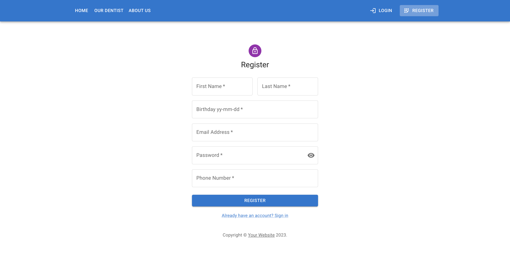

# API Dental Clinic

  
Contenido 📝

  <ol>
    <li><a href="#objetivo-🎯">Objetivo</a></li>
    <li><a href="#acerca-de-este-proyecto-🔎">Acerca de este proyecto</a></li>
    <li><a href="#stack">Stack</a></li>
    <li><a href="#instalación-en-local">Instalación</a></li>
    <!-- <li><a href="#vistas">Vistas</a></li> -->
    <li><a href="#futuras-funcionalidades">Futuras funcionalidades</a></li>
    <li><a href="#webgrafia">Webgrafia</a></li>
    <li><a href="#contacto">Contacto</a></li>
  </ol>

## Objetivo 🎯

Nuestro objetivo era desarrollar una API funcional para requerir datos a una DB, con la apariencia de una clínica dental.

## Acerca de este proyecto 🔎

Frontend de una clínica dental desarrolado en REACT. Los usuarios (Paciente, Dentista, Admin), pueden acceder a un numero de peticiones y así visualizar su perfil, crear citas, modificarlas o borrarlas.

## Stack

 

## Instalación en local

1. Clonar el repositorio
2. `$ npm install`
3. `$ npm run dev`

## Vistas

Home

Register

Login

Patient profile

Dentist profile

Admin panel

## Credenciales

credenciales

- AUTH

- Contraseña para todos los usuarios

      12345678

- Como paciente

      steven@garzon.com

- Como dentista

      jane@doe.com

- Como admin

      jane@doe.com

</datails>

## Futuras funcionalidades

✅ Buscar citas por id o nombre de paciente. 
⬜ Añadir crear citas para los usuarios con rol de Medico 
⬜ Crear un perfil decicado al admin con funciones unicas. 
⬜ ...

## Webgrafia:

- https://mui.com/material-ui/getting-started/

## Contacto

